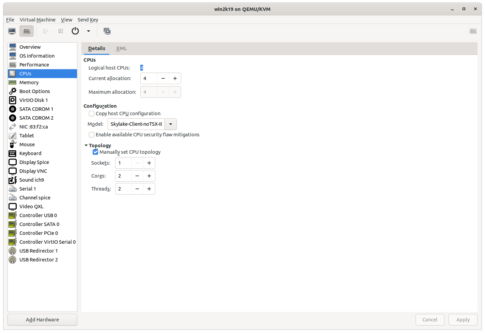

# Virtual Machine Manager

### Windows 10

#### Nested Virtualization

* To enable nested virualization for WSL2:
    
      <cpu mode="custom" match="exact" check="partial">
        <model fallback="allow">Skylake-Client-noTSX-IBRS</model>
        <topology sockets="1" cores="2" threads="2"/>
        <feature policy="require" name="vmx"/>
      </cpu>
* Or
    

* With

        <feature policy="require" name="vmx"/>
        
